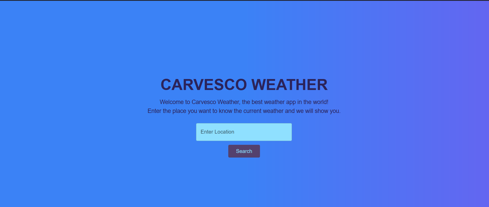

# Carvesco Weather App

This is a [Next.js](https://nextjs.org) project bootstrapped with [`create-next-app`](https://nextjs.org/docs/app/api-reference/cli/create-next-app) that display weather information of a location using the [`OpenWeather API`](https://openweathermap.org/api).

deployed app:
[`carveso-weather app`](https://carvesco-weather.vercel.app/)

## Installation

after clonning the repository install the modules:

```bash
npm install
```

create an .env file in the root, here comes ur enviroment variables:

```
NEXT_PUBLIC_WEATHER_API_KEY = YOUR_API_KEY
```

## Getting Started

First, run the development server:

```bash
npm run dev
# or
yarn dev
# or
pnpm dev
# or
bun dev
```

Open [http://localhost:3000](http://localhost:3000) with your browser to see the result.

## Usage

Just input or select the city you want weather information about and press search.


